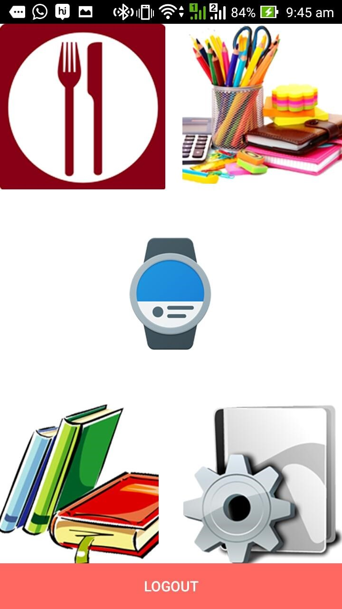
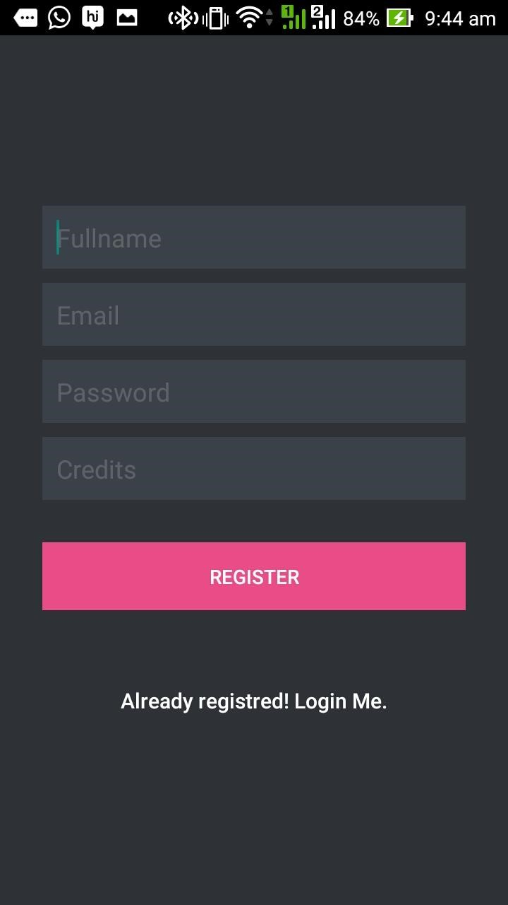
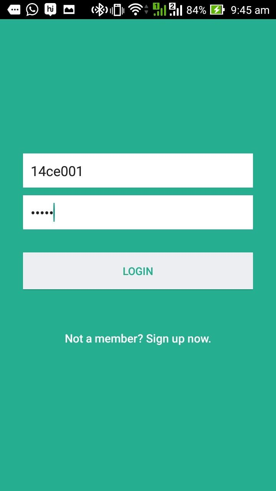

# Cash-Free
This project is a student utility android application developed specifically for CHARUSAT, Changa education campus currently. The students are facilitated to pay money to canteen, stationary and library in the form of credits that they have earned from admin by giving its equivalent cash. There is registration page from where a student can get registered to the app and later the same credentials can be used to login to the application. Inside application there are main 5 modules containing canteen pay, stationery pay, library fine, options and wear connect respectively. Further, options module has functionality for admin to refill credits followed by show credits module that shows the whole transaction per student logged in. At the end, when a student logout then the corresponding credits and details get updated to the database.

# Screenshots

